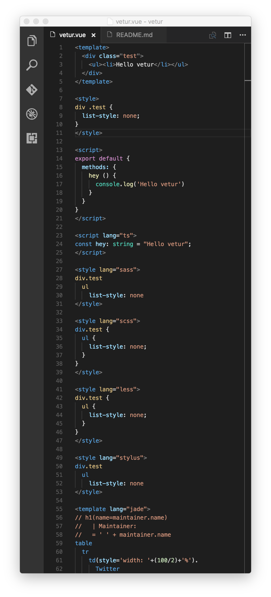

# vetur

Vue tooling for VSCode.  

## Implemented Features

- Syntax highlighting for:
  - html/jade/pug
  - css/sass/scss/less/stylus
  - js/ts
- emmet for `<template>`

## Demo

Try for yourself on this file: [demo/vetur.vue](https://github.com/octref/vetur/blob/master/demo/vetur.vue).



## Setup

- Install [vetur](https://marketplace.visualstudio.com/items?itemName=octref.vetur)
- In your user settings, set

  ```json
  "files.associations": {
    "*.vue": "vue"
  }
  ```

- Install [Stylus extension](https://marketplace.visualstudio.com/items?itemName=sysoev.language-stylus) for Stylus support

## Roadmap

- [ ] Error checking for html
- [ ] Error checking for css/scss
- [ ] IntelliSense for css/scss
- [ ] Basic IntelliSense for js/es6 in `<script>`, like suggesting props for `this.`
- [ ] Jump to definition
- [ ] Basic IntelliSense for js/es6 in `<template>`
- [ ] Advanced IntelliSense, such as suggesting state/getters for `this.$store` 
- [ ] Advanced features enabled through language server, such as hover

## Credits

- Logo from [vuejs/vuejs.org](https://github.com/vuejs/vuejs.org)
- Grammar based on [vuejs/vue-syntax-highlight](https://github.com/vuejs/vue-syntax-highlight)
- Sass grammar based on [P233/Syntax-highlighting-for-Sass](https://github.com/P233/Syntax-highlighting-for-Sass)
- JS grammar based on [atom/language-javascript](https://github.com/atom/language-javascript)

## License

MIT © [Pine Wu](https://github.com/octref) 
